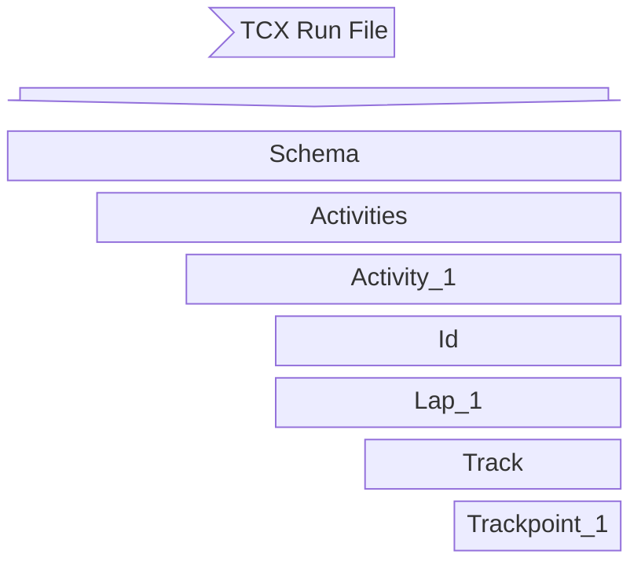

+++
date = 2024-08-25
title = "Workout Records"
description = "Life update, workout files, and ideas for Strava."
series = ["writing"]
tags = ["x-ray", "data", "xml", "strava", "coros"]
[paige]
edit = "https://github.com/pbj-writes/portfolio_hugo/edit/main/content/%s"
[paige.list_page]
disable_authors = false
disable_date = false
disable_keywords = false
disable_reading_time = false
disable_series = false
disable_summary = false
[paige.page]
disable_authors = false
disable_date = false
disable_keywords = false
disable_next = true
disable_prev = true
disable_reading_time = false
disable_series = true
disable_toc = false
[paige.site]
disable_breadcrumbs = false
disable_credit = false
disable_license = false
+++

## Life Update
I earned my cycling stripes. At the end of July, I crashed my bike and broke my collarbone. I know what you are all thinking ... is the bike okay? My bike was fine after a minor tune-up. I had to have surgery where the surgeon used a plate and screws to ensure the bone heals in its original shape and position. Anyway, I have had a lot of time to sit around and think about post ideas and I started to think about how fitness devices record our workouts.

|   |   |
|---|---|
|    |    | 

## Workout Files
When I began recording my workouts, I used a mobile app called MapMyRun. After about two years, a friend recommended that I use Strava. Once I started using Strava, I loved it, so I wanted to get my complete history over into Strava. To get everything in Strava, I downloaded files from MapMyRun and imported them into Strava. At this time, I never thought about what these files were or what was in them.

Years later I'd finally invest in my first fitness trackers by Fitbit and Garmin then eventually also Coros. Integration is pretty easy. You sign up for an account with tracker company such as Garmin or Coros and both Strava and fitness tracker companies allow you, with settings options, to sync workouts from device/fitness tracking platform to Strava. Every once in a while something would not work right and workouts wouldn't sync to Strava. This happened for many reasons. For example, a device battery ran out in the middle of a workout, the Strava platform experienced an outage, or other unexplained reasons. 

When a workout didn't sync to Strava, my compulsion kicked in. After all, if it's not on Strava, then it didn't happen. Amiright? To get a workout into Strava that didn't sync, I'd have to download the workout from the fitness device or online service, and then upload it manually into Strava. I did this from time to time, but I didn't start getting curious about what was in these files until I started Zwifting during the COVID-19 pandemic in 2020. My Zwift workouts would become corrupted during the workout because I'd lose internet connectivity. This drove me nuts. Even Zwift, the online service, wouldn't have the workout file, but the local Zwift application I ran Zwift with would have a file. Once I figured this out, I'd try uploading the files to Strava even though my Zwift account wouldn't have the 'activity' officially registered. A few times the upload would fail citing a file corruption. So, I started opening the files and taking a look. 

Again later, my Garmin workout would show some bogus heart rate data or pace, so I would start to open the workout files straight from my watch to investigate what was going on. And to my surprise, the workout files were just some XML... just some metadata. In grad school, I had an entire course on Metadata, so nothing seemed mystifying to me.

## Explaining Workout Files
Fitness devices such as watches, bike computers, and heart rate monitors record your workout locally on the device. Once a workout is complete, the device may sync over Bluetooth or WiFi or require a USB connection to a computer to migrate the workout file. 

The workout file could be one of several formats. A few formats include:
- .tcx
- .fit

The fitness device industry had supported XML formats such as .gpx or .tcx, but now .fit is the more advanced and ubiquitous format. For this post, I'll use a workout in the .tcx format since the .fit format is difficult to [explain and show](https://developer.garmin.com/fit/overview/).

Below are the first few lines of a .tcx file based on a run in my neighborhood.⬇️ 

 
<?xml version="1.0" encoding="UTF-8"?>
<TrainingCenterDatabase xsi:schemaLocation="http://www.garmin.com/xmlschemas/TrainingCenterDatabase/v2 http://www.garmin.com/xmlschemas/TrainingCenterDatabasev2.xsd" xmlns:ns5="http://www.garmin.com/xmlschemas/ActivityGoals/v1" xmlns:ns3="http://www.garmin.com/xmlschemas/ActivityExtension/v2" xmlns:ns2="http://www.garmin.com/xmlschemas/UserProfile/v2" xmlns="http://www.garmin.com/xmlschemas/TrainingCenterDatabase/v2" xmlns:xsi="http://www.w3.org/2001/XMLSchema-instance" xmlns:ns4="http://www.garmin.com/xmlschemas/ProfileExtension/v1">
 <Activities>
  <Activity Sport="Running">
   <Id>2024-07-19T16:13:25Z</Id>
   <Lap StartTime="2024-07-19T16:13:25Z">
  

- On line 1⬆️, the workout file is XML.
- On line 2⬆️, the XML schema is defined.
- On line 3⬆️, the wrapper element is called 'Activities'. So, in theory, you could have one or more activities in a workout file.
- On line 4⬆️, the element is called 'Activity' with an attribute of `Sport="Running"`.
- On line 5⬆️, the element 'Id' is used to uniquely identify that activity.

Here are the next few lines.⬇️

   <Lap StartTime="2024-07-19T16:13:25Z">
    <TotalTimeSeconds>536</TotalTimeSeconds>
    <DistanceMeters>1609</DistanceMeters>
    <Intensity>Active</Intensity>
    <TriggerMethod>Manual</TriggerMethod>
    <MaximumHeartRateBpm>
     <Value>158</Value>
    </MaximumHeartRateBpm>
    <AverageHeartRateBpm>
     <Value>144</Value>
    </AverageHeartRateBpm>


The 'Lap' element contains many sub-elements that describe the lap. For example, the average hr of the lap is 144 BPM.

Here is the next set of elements.⬇️   

    <Track>
     ...
     <Trackpoint>
      <Time>2024-07-19T16:13:33Z</Time>
      <Position>
       <LatitudeDegrees>33.9281844</LatitudeDegrees>
       <LongitudeDegrees>-118.0950039</LongitudeDegrees>
      </Position>
      <DistanceMeters>14</DistanceMeters>
      <HeartRateBpm>
       <Value>91</Value>
      </HeartRateBpm>
      <Extensions>
       <Speed>8.430000</Speed>
      </Extensions>
     </Trackpoint>
     <Trackpoint>
      <Time>2024-07-19T16:13:34Z</Time>
      <Position>
       <LatitudeDegrees>33.9282103</LatitudeDegrees>
       <LongitudeDegrees>-118.0950017</LongitudeDegrees>
      </Position>
      <DistanceMeters>17</DistanceMeters>
      <HeartRateBpm>
       <Value>93</Value>
      </HeartRateBpm>
      <Cadence>83</Cadence>
      <Extensions>
       <Speed>8.760000</Speed>
      </Extensions>
     </Trackpoint>


The 'trackpoint' elements are where the info that you care about during your workout is stored. You can see that one second elapses between these trackpoints. So, within this lap, each second of time worth of data is recorded along with hr, position, and other KPIs.

Here is a simple visualization of the overall organization and logic of this workout file type (.tcx).
    

## Workout File Implication
With the TCX file example in this post, I could modify virtually any of the values in the file. It became clear to me this is how racers had started to game Esports like Zwift. From my understanding, Zwift requires pro racers to submit two separate recordings of their race/performance. The relationship of power, hr, and time readings between the two files validate or flag the performance. If a workout file is modified, it's likely caught in this review. That doesn't mean there aren't other ways to game Zwift, but these XML based workout file types present an easy opportunity. On the other hand, the .fit workout file type is not XML based and requires more of a learning curve to view and edit. 

## Uploading to Strava
The beauty of Strava is that when you upload a workout file, Strava can associate additional data against your workout. For instance, if I had manually uploaded the .tcx run file referenced in this post, Strava adds:
- editable title
- optional description
- optional private notes
- gear (such as shoes)
- variable sport selection
- perceived exertion

Strava adds value to users with perceived exertion. From experience, I've done many runs where my watch or even strap did not record accurate hr data or I didn't have any hr monitor/data. So, Strava offers perceived exertion to fill in incorrect or missing data to help track fitness over time. 

### Idea for Strava 💩
Although training for an Ironman race is probably not what the average Strava user is doing, I found during my training that I had no way to note and then track when I needed to use the bathroom during long workouts. I started to notice some trends on my own, but Strava could also potentially help point out to its users when a user tends to use the bathroom. For instance, Strava could simply implement an optional 💩 flag. When a user's activity syncs with Strava, a user could edit the activity and select the 💩 flag. The time of the activity is now associated with the 💩. Over time, Strava could recommend users to use the bathroom before workouts during xyz time of day based on recent trends. One flaw with this idea is that 💩 regularity can change for many reasons. Statistically, this feature might not provide enough value. 