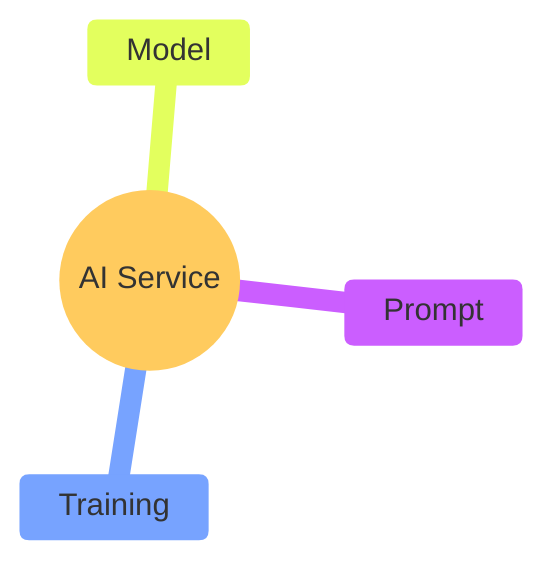

+++
date = 2025-11-06
description = "🤖 Helpful or sloppy?"
series = ["writing"]
tags = ["writing"]
title = "AI Assistant"
[paige]
edit = "https://github.com/pbj-writes/portfolio_hugo/edit/main/content/%s"
[paige.list_page]
disable_authors = false
disable_date = false
disable_keywords = false
disable_reading_time = false
disable_series = false
disable_summary = false
[paige.pages]
disable_authors = false
disable_date = false
disable_keywords = true
disable_next = true
disable_prev = true
disable_reading_time = false
disable_series = false
disable_toc = true
[paige.site]
disable_breadcrumbs = true
disable_credit = true
disable_license = true
+++

## Update Before the AI Stuff

This summer and fall were eventful. My partner's parents moved in with us. We helped them sell their house. We bought a duplex together. My partner and I sold our house. Many storage unit trips and packing and unpacking and fixing up an old duplex.

Then at work, my manager was laid off and our VP has doubled down on my team's doc modernization efforts, so I'm further emboldened to look at more bells and whistles for our documentation strategy. This includes AI.

## AI Assistant

I wasn't sure where to start other than I wanted to add a free AI chat service on my website with a few questions to answer. 

- How hard is it to incorporate AI into a UX? 
- What levers do I have to maximize the helpfulness of the AI?
- What can I glean about writing content for AI consumption? 

## Incorporate an AI Chat Service

[LiveChatAI](https://livechatai.com) gave me a simple form to fill out before giving me code to embed on my site. The experience was much easier than I thought. I will note that I had to create an account since trying to use the service without an account appeared to be broken. In short, all I had to do was add the embed code to my `baseof.html` Hugo layout.

## Maximize Helpfulness of the AI

I see four primary ways to make AI useful for your requirements and use cases.

### #1: AI Model or Service Itself

The selection of the service locks you into features, limitations, and specs.

### #2: Model

The configuration and training of the model impacts the quality and performance of the AI.

### #3: Prompt

The prompt places bounds and instructions on the AI's responses.

### #4: Training Data

The information the AI has to inform its responses.

## Authoring Content for AI Consumption

After pointing the AI to my site, I asked a few questions about my website and the answers were subpar. Some of the reasoning was missing. For example, the AI couldn't figure out what tech stack I used for my site even though the landing page clearly states that I use Hugo. 

I dropped some plaintext content into the training data and the performance improved. The key was to explicitly provide context. Instead of relying on the AI to see "Built with code using Hugo" and understanding that, I provided a specification for the tech stack of my site and sub-domains. The responses improved. 

I'll continue testing and playing, but my initial takeaway is that testing must be a part of the feedback loop to evaluate how AI interprets and processes the content. I think certain implicit communications that humans are used to are not always understood by AI.