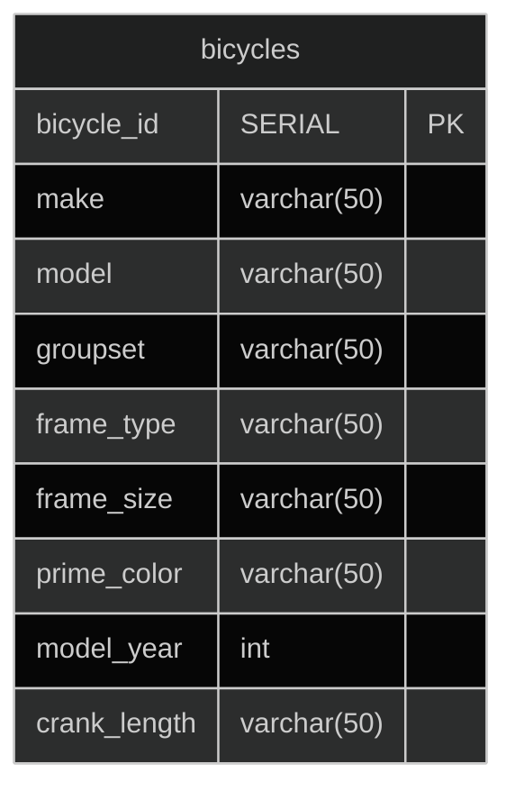

## Introduction

I wanted to gain a deeper understanding of APIs and demonstrate my [API doc](#view-api-dochttpsdocspbjwritesinfo) skills, so I set out to create a data-driven API application. I started with an idea to track all of my current and former bicycles. I knew that I could easily (but sloppily) design a bicycle data table. And from this point, I did a lot of searching.

## Tools
### Database
I can write SQL but I needed a solution to host my db online in the cloud. I came across [https://elephantsql.com](https://elephantsql.com). They offer to host a limited, but free, Postgres database instance.

> **IMPORTANT**  
> Elephant SQL announced its [EOL](https://www.elephantsql.com/blog/end-of-life-announcement.html).

### API server and code platform for APIs
I'm not a developer so finding how to write some basic APIs was intimidating, but after some next-level internet searching, I found a [step-by-step guide](https://dev.to/fredabod/a-step-by-step-guide-to-using-elephantsql-with-nodejs-and-express-2e9f) for using ElephantSQL with Node.js and Express. 

### IDE
[Visual Studio Code](https://code.visualstudio.com).

### API Platform
[Postman](https://www.postman.com)

## Design

## Data Model
### SQL

-- create the bicycles table with a few bicycle attributes.
CREATE TABLE bicycles (
    bicycle_id	SERIAL PRIMARY KEY,
    make varchar(50),
    model varchar(50),
    groupset varchar(50),
    frame_type varchar(50),
    frame_size varchar(50),
    prime_color varchar(50),
    model_year int,
    crank_length varchar(50)
);

-- add the four road bikes that I've ever owned.
INSERT INTO bicycles (make, model, groupset, frame_type, frame_size, prime_color, model_year, crank_length)
VALUES
('Specialized', 'Sequoia Sport', 'Shimano Sora', 'aluminum', '60cm', 'silver', '2003', '175mm'),
('Cannondale', 'CAAD8', 'Shimano Tiagra', 'aluminum', '58cm', 'white', '2014', '172.5mm'),
('Cannondale', 'CAAD13 Disc Rival AXS', 'Rival eTAP', 'aluminum', '58cm', 'purple', '2021', '175mm'),
('Cannondale', 'Topstone 4', 'microSHIFT Advent 10', 'aluminum', 'large', 'alpine', '2021', '175mm');


## Demo


## [View API Doc](https://docs.pbjwrites.info)